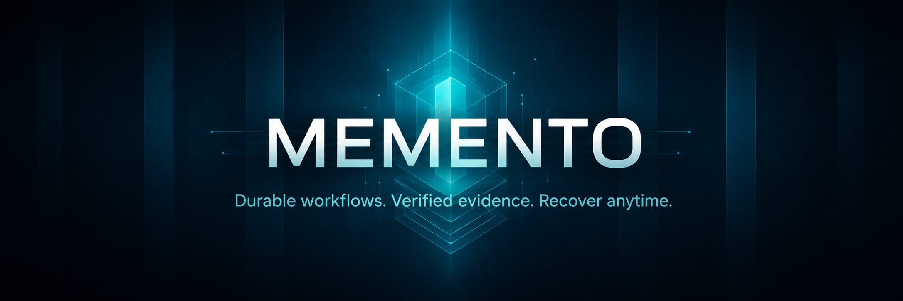

# Memento

English | [한국어](README.ko.md)



Memento is a Hermes-native lifecycle and evidence ledger for AI-assisted software work.

It exists because long-running agent work usually fails in a very ordinary way: the real state of the work lives in the wrong place. A chat transcript says one thing, a TUI buffer says another, an executor session disappears, and a summary claims the tests passed without proving it. Memento moves that state into a project-local ledger: runs, plans, tasks, dispatches, review gates, evidence, and audit events that survive chat resets and process restarts.

The short version:

> Work is not done because an agent says it is done. Work is done when the ledger points to evidence you can inspect.

## What Memento is for

Use Memento when AI-assisted development starts to outgrow a single chat window:

- you want a canonical plan before implementation starts;
- you want incoming requests, cron events, and webhook payloads to become durable tasks instead of ad hoc instructions;
- you want handoffs to humans or Hermes-controlled workers to be auditable;
- you want completion to require evidence such as test output, CI status, lint logs, generated artifacts, code diffs, screenshots, or explicit approvals;
- you want to recover work after chat compaction, executor crashes, process restarts, or a lost terminal session;
- you want a readable progress report rebuilt from state, not from hidden executor memory.

Memento is not trying to make AI coding more magical. It is trying to make it harder to lose track of what happened.

## What Memento is not

Memento is deliberately narrow.

It is not:

- an OpenCode, Codex, or Claude Code wrapper;
- an integration guide for those tools;
- a compatibility shim for another lifecycle system;
- a replacement for tests, review, or user approval;
- a system that treats an executor summary as proof;
- a system that depends on private TUI/session state for correctness.

The supported public onboarding path is Hermes Agent plus the `memento` CLI. Future executor adapters may hand work to other runtimes, but they are not part of the current installation or correctness model.

## Install from PyPI

```bash
python -m pip install memento-lifecycle
memento doctor --json
memento sample-smoke --workspace /tmp/memento-sample --json
```

The PyPI distribution is `memento-lifecycle`. The installed CLI and Python import package are still named `memento`.

## Hermes Agent installation

The guided installation flow is written for Hermes Agent. It configures Hermes Agent only and does not set up any other coding runtime.

Paste this into Hermes Agent:

```text
Install and verify Memento by following the instructions here:
https://raw.githubusercontent.com/antchoi/memento/main/docs/guide/installation.md
```

Or read the [Installation Guide](docs/guide/installation.md). It walks Hermes Agent through a Python 3.11+ environment, dependency installation, `memento doctor`, the smoke contract, optional local `agentmemory`, and the exact evidence to report back.

If you are already inside a source checkout, the default local path is:

```bash
scripts/install-local.sh --dev
```

For a minimal runtime install from a checkout:

```bash
scripts/install-local.sh
```

To run directly from source without installing the console script:

```bash
PYTHONPATH=src python -m memento.cli doctor --json
```

### Optional local agentmemory for Hermes Agent

Memento keeps lifecycle truth in its own ledger. If you also want cross-session memory for Hermes Agent, run `agentmemory` locally and connect it through MCP:

```bash
scripts/install-local.sh --agentmemory
```

Then add the MCP server shown in [`docs/guide/installation.md`](docs/guide/installation.md#connect-hermes-to-agentmemory-via-mcp), restart Hermes, and verify:

```bash
hermes mcp list
hermes mcp test agentmemory
```

Keep agentmemory ports bound to localhost unless you explicitly choose remote exposure.

## First check

Run the smoke contract:

```bash
memento sample-smoke --workspace /tmp/memento-sample --json
memento status --workspace /tmp/memento-sample --json
memento report --workspace /tmp/memento-sample
```

`sample-smoke` initializes a workspace, runs `doctor`, creates a sample run, enqueues a task, writes an outbox handoff, claims and completes it without spawning an external executor process, and proves that `status` and `report` can be rebuilt from durable project-local state.

## The first real run

A normal Memento workflow is intentionally conservative. You create a run, approve a plan, turn work into a task, hand it off, and only mark it complete with evidence.

```bash
memento init --workspace /path/to/repo --json

memento start \
  --workspace /path/to/repo \
  --goal "Ship the next verified slice" \
  --allow-spike \
  --json
```

Create and approve the canonical plan:

```bash
memento plan \
  --workspace /path/to/repo \
  --run-id run_... \
  --title "Next slice" \
  --body "Write tests, implement the slice, verify it, and record evidence." \
  --json

memento approve-plan \
  --workspace /path/to/repo \
  --run-id run_... \
  --plan-id plan_... \
  --json
```

Turn the next piece of work into a durable task and generate an explicit worker payload:

```bash
memento enqueue-event \
  --workspace /path/to/repo \
  --run-id run_... \
  --title "Implement X" \
  --body "Task details and acceptance criteria" \
  --json

memento worker-payload \
  --workspace /path/to/repo \
  --run-id run_... \
  --task-id task_... \
  --json
```

Record the handoff and completion:

```bash
memento dispatch-task \
  --workspace /path/to/repo \
  --run-id run_... \
  --task-id task_... \
  --executor hermes-profile \
  --json

memento claim-dispatch \
  --workspace /path/to/repo \
  --dispatch-id dispatch_... \
  --executor hermes-profile \
  --json

memento complete-dispatch \
  --workspace /path/to/repo \
  --dispatch-id dispatch_... \
  --summary "Implemented and verified" \
  --evidence-uri file://verification/task.log \
  --json
```

Then rebuild status from the ledger:

```bash
memento status --workspace /path/to/repo --run-id run_... --json
memento report --workspace /path/to/repo --run-id run_...
```

## Core model

- **Run**: the top-level unit of work for one goal in one workspace.
- **Plan**: a draft or canonical implementation plan. Normal execution is blocked until a canonical plan exists, unless the run explicitly allows a bounded spike.
- **Task**: a durable work item created from a plan, user request, cron event, webhook, or manual enqueue.
- **Dispatch**: an auditable handoff record. It does not prove that work happened.
- **Review gate**: a checkpoint for preflight safety, plan review, implementation/spec review, quality review, final acceptance, approval, or release readiness.
- **Evidence**: an inspectable artifact such as command output, test results, CI status, lint output, a generated file, a screenshot, a verified diff, or an approval record.
- **Audit event**: append-only lifecycle history used for recovery and accountability.
- **Report**: a chat-readable summary rebuilt from Memento state.

## Trust model

Memento treats these as trusted evidence when they are linked to the ledger:

- command output with exit code;
- test, lint, type, compile, smoke, or CI results;
- generated artifacts with stable paths;
- verified code diffs;
- explicit approvals;
- graph or memory snapshots used as supporting context.

These are advisory only until evidence backs them:

- "I finished" summaries;
- private reasoning traces;
- raw chat history;
- executor-native session state;
- TUI buffers and logs with no verification artifact.

This split is the point of the project. Memento does not ask you to trust a better summary. It asks you to attach proof.

## Command map

Read the full command guide in [`docs/commands.md`](docs/commands.md). The main groups are:

- setup and health: `doctor`, `init`, `sample-smoke`;
- lifecycle: `start`, `plan`, `approve-plan`, `pause`, `resume`, `cancel`, `status`, `report`;
- tasks and handoff: `enqueue-event`, `worker-payload`, `dispatch-task`, `list-dispatches`, `claim-dispatch`, `complete-dispatch`, `fail-dispatch`;
- verification and context: `context-bundle`, `route-task`, `verify-task`, `graph-status`, `graph-update`, `memory-prefetch`, `memory-writeback`;
- worker/release gates: `record-external-check`, `record-approval`, `record-graph-diff`, `select-patch`, `release-gate`, `recover-jobs`;
- review: `review`.

## Hermes plugin boundary

The local Hermes plugin entry point is `memento.plugin:register`:

```toml
[project.entry-points."hermes_agent.plugins"]
memento = "memento.plugin"
```

The registration boundary is intentionally small. A Hermes-like context only needs:

```python
ctx.register_command(name, handler, **metadata)
```

`memento doctor --json` and `tests/test_plugin_registration.py` are the executable registration contract.

## Documentation

Start here:

- [`docs/README.md`](docs/README.md): documentation map.
- [`docs/guide/installation.md`](docs/guide/installation.md): Hermes Agent installation, dependency setup, plugin enablement, verification, and optional local agentmemory.
- [`docs/guide/publishing.md`](docs/guide/publishing.md): PyPI/TestPyPI release checklist and GitHub Actions Trusted Publishing.
- [`docs/getting-started.md`](docs/getting-started.md): first smoke test and first run after installation.
- [`docs/concepts.md`](docs/concepts.md): lifecycle concepts and trust model.
- [`docs/commands.md`](docs/commands.md): command reference by workflow.
- [`docs/operators-guide.md`](docs/operators-guide.md): safety, recovery, cron/events, and reporting.
- [`docs/architecture.md`](docs/architecture.md): implementation architecture and extension boundaries.
- [`docs/user-guide.md`](docs/user-guide.md): compact end-to-end guide.

## Development verification

```bash
python -m pytest -q
python -m ruff check .
python -m compileall -q src tests
PYTHONPATH=src python -m memento.cli doctor --json
PYTHONPATH=src python -m memento.cli sample-smoke --workspace /tmp/memento-sample --json
scripts/verify-local.sh
```

## Traceability

The implementation history is driven by the Ouroboros source Seed at `.ouroboros/seeds/memento.seed.yaml` and follow-on phase seeds:

- `.ouroboros/seeds/memento.seed.yaml`
- `.ouroboros/seeds/memento-mvp.seed.yaml`
- `.ouroboros/seeds/memento-v1.seed.yaml`
- `.ouroboros/seeds/memento-v2.seed.yaml`
- `.ouroboros/seeds/memento-v3.seed.yaml`

The detailed acceptance criteria live in those seed files. The retained token map is here for mechanical traceability:

`AC01_repo_bootstrap`, `AC02_plugin_registration`, `AC03_command_surface`, `AC04_draft_to_canonical_plan`, `AC05_durable_state`, `AC06_kanban_boundary`, `AC07_preflight_safety`, `AC08_destructive_guardrails`, `AC09_worker_context`, `AC10_review_gates`, `AC11_reporting`, `AC12_cancellation_pause`, `AC13_bundled_skills`, `AC14_documentation`, `AC15_no_opencode_dependency`, `AC16_test_suite`, `AC17_lint_type_baseline`, `AC18_seed_traceability`, `AC19_actor_input_output_runtime_closure`, `AC20_cron_event_to_task_only`, `AC21_role_last_action_visibility`, `AC22_sqlite_fallback_contract`.

This README stays focused on orientation, installation, and the first verified workflow.
